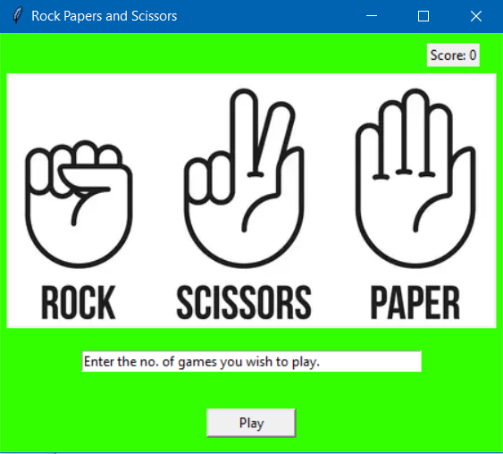

# Rock-Papers-and-Scissors
Making Rock Papers and Scissors using Tkinter.

## Output Screens
Screen 1: Home Screen where user enters the number of games they wish to play

Screen 2: Game Screen where user makes choices between rock, papers and scissors.

## Future Updates:
- Improving the GUI
- Creating a user-exclusive scoreboard system
